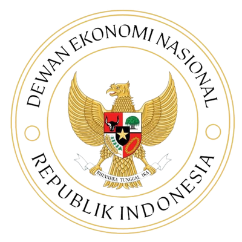

## Slide teks: ukuran normal

- Paling banyak enam butir, masing-masing paling banyak dua baris.
- Satu slide membawa satu pesan; judul slide menyatakan pesan itu.
- Jika isi tidak muat, pecah menjadi dua slide.
- `.shrink` diabaikan oleh template dan menghasilkan peringatan saat render.

::: {.takeaway}
Kotak takeaway memuat satu pesan utama slide, paling banyak dua baris.
:::

## Slide teks: `.small` {.small}

- `.small` memuat sampai delapan butir.
- Ukuran huruf sama di semua slide `.small`.
- Kotak takeaway tetap berukuran sama di slide normal, `.small` dan `.smaller`.
- Gunakan `.smaller` hanya untuk tabel atau persamaan yang padat.

## Persamaan

Model gravitasi yang dilinearkan:

$$
y_{ij} = \beta_0 + \beta_1 Dist_{ij} + \beta_2 gdp_i + \varepsilon_{ij}
$$

dengan $y_{ij}$ log ekspor dari negara asal $i$ ke negara tujuan $j$, $Dist_{ij}$ log jarak antara $i$ dan $j$, $gdp_i$ log PDB negara $i$, dan $\varepsilon_{ij}$ galat.

::: {.takeaway}
Setiap variabel dan parameter didefinisikan tepat di bawah persamaannya.
:::

## Tabel: sel satu baris

| Variabel | Koefisien | Galat baku | N |
|:---------|----------:|-----------:|--:|
| Log jarak | $-1{,}12$ | 0,08 | 4.210 |
| Log PDB asal | 0,94 | 0,05 | 4.210 |
| Log PDB tujuan | 0,81 | 0,06 | 4.210 |
| FTA | 0,27 | 0,11 | 4.210 |
| Perbatasan bersama | 0,43 | 0,15 | 4.210 |

Sumber: angka ilustrasi.

## Tabel: sel banyak baris {.smaller}

+-------------------+------------------------------+---------------+-------------------------------+
| Dimensi           | Perhitungan utama            | Metode        | Yang diukur                   |
+===================+==============================+===============+===============================+
| Konsentrasi       | HHI impor; pangsa pemasok    | EXVI + PC     | Apakah impor berasal dari     |
|                   | terbesar                     |               | sedikit negara?               |
+-------------------+------------------------------+---------------+-------------------------------+
| Ketergantungan    | Rasio impor terhadap ekspor  | EXVI          | Seberapa lemah kapasitas      |
|                   |                              |               | ekspor relatif terhadap impor?|
+-------------------+------------------------------+---------------+-------------------------------+
| Persistensi       | Rata-rata bergulir tiga      | CEPII         | Apakah sinyalnya struktural,  |
|                   | tahun                        |               | bukan guncangan satu tahun?   |
+-------------------+------------------------------+---------------+-------------------------------+

Sumber: angka ilustrasi.

## Gambar penuh dari code chunk

```{python}
import fig_den as den
import matplotlib.pyplot as plt
import numpy as np

den.style()
plt.rcParams.update({"font.size": 8, "axes.titlesize": 8, "axes.labelsize": 8,
                     "xtick.labelsize": 7, "ytick.labelsize": 7, "legend.fontsize": 7})

years = np.arange(2015, 2026)
series = {"Seri A": 100 * 1.05 ** (years - 2015), "Seri B": 100 * 1.02 ** (years - 2015)}

fig, ax = plt.subplots(figsize=(5.5, 2.2))
for (name, values), colour in zip(series.items(), [den.BROWN, den.GOLD]):
    ax.plot(years, values, label=name, color=colour)
ax.set_xlabel("Tahun")
ax.set_ylabel("Indeks (2015 = 100)")
ax.legend(frameon=False)
fig.tight_layout()
plt.show()
```

Garis menunjukkan indeks dua seri ilustrasi (sumbu-y) per tahun (sumbu-x). Sumber: angka ilustrasi.

## Gambar dari berkas: `.fig-half`

{.fig-half}

Slot `.fig-half` menyisakan ruang untuk teks dan kotak takeaway di slide yang sama.

::: {.takeaway}
Gunakan `.fig-full` bila gambar adalah isi slide, `.fig-half` bila gambar berbagi tempat dengan teks.
:::

## Gambar dalam kolom

:::: {.columns}

::: {.column width="55%"}
{.fig-full}
:::

::: {.column width="45%"}
- Di dalam kolom, lebar slot mengikuti lebar kolom.
- Jumlah lebar kolom paling banyak 100%.
- Paling banyak dua kolom per slide.
:::

::::

## Card: dua kolom

:::: {.cols height="60%"}

::: {.card title="Skrining"}
- Konsentrasi pemasok dari data perdagangan.
- Menghasilkan daftar pendek kerentanan.
:::

::: {.card .gold title="Penilaian"}
- Kritikalitas dan substitusi aktual.
- Menghasilkan peringkat risiko.
:::

::::

::: {.takeaway}
Tiap slot boleh berisi card, teks biasa, atau gambar.
:::

## Card: dua kolom dan satu baris

:::: {.cols}

::: {.card title="EXVI"}
Skor kontinu 0 sampai 1: risiko ketergantungan dan posisi global yang lemah.
:::

::: {.card .gold title="PC"}
Uji biner: pemasok di atas 80%, pangsa global di atas 50%, sumber yang sama.
:::

::: {.card .wide}
Keluaran: daftar pendek kerentanan berbasis perdagangan, belum menjadi daftar produk kritis.
:::

::::

## Card: 2 × 2, baris bawah pendek

:::: {.cols rows="2,1"}

::: {.card title="Klasifikasi risiko"}
- Tier 0: konsentrasi komersial normal.
- Tier 1: konsentrasi sumber.
- Tier 2: ketergantungan kritis terkelola.
:::

::: {.card .gold title="Tangga kebijakan"}
- Pantau dan ungkap.
- Diversifikasi komersial.
- Siapkan kontingensi.
:::

::: {.card}
Input: peringkat EXVI dan tanda PC.
:::

::: {.card}
Keluaran: instrumen berbiaya terendah.
:::

::::

## Card: 3 × 2

:::: {.cols n=3}

::: {.card title="1 Kritikalitas"}
Fungsi esensial apa yang berhenti?
:::

::: {.card .gold title="2 Kapasitas domestik"}
Bisakah produksi ditingkatkan?
:::

::: {.card .dark title="3 Substitusi"}
Adakah pemasok lain yang kompatibel?
:::

::: {.card title="4 Penyangga"}
Berapa lama stok bertahan?
:::

::: {.card .gold title="5 Probabilitas"}
Kontrol ekspor, konflik, iklim.
:::

::: {.card .dark title="6 Validasi"}
Apakah guncangan lalu menekan output?
:::

::::

## Card: enam kolom dan satu baris

:::: {.cols n=6 rows="2,1" height="70%"}

::: {.card title="0 Material"}
Nilai dan volume dagang.
:::

::: {.card title="1 Konsentrasi"}
HHI dan Top-1.
:::

::: {.card title="2 Rasio"}
Impor terhadap ekspor.
:::

::: {.card .gold title="3 Posisi"}
RCD dan harga.
:::

::: {.card .gold title="4 Substitusi"}
HHI global.
:::

::: {.card .gold title="5 Persisten"}
Dua dari tiga tahun.
:::

::: {.card .wide .dark title="Tahap berikutnya"}
Kritikalitas, produksi domestik, substitusi aktual, persediaan, waktu pemulihan, dan probabilitas gangguan.
:::

::::

## Card: 4 × 2

:::: {.cols n=4}

::: {.card title="Komisi Eropa"}
Tiga kriteria kumulatif.
:::

::: {.card title="CEPII"}
Kriteria UE tiap tahun.
:::

::: {.card title="OECD"}
Konsentrasi impor dan ekspor.
:::

::: {.card title="IMF"}
Sentralitas jaringan.
:::

::: {.card .gold title="Bank of England"}
Eksposur tersembunyi.
:::

::: {.card .gold title="Australia PC"}
Uji tiga saringan.
:::

::: {.card .gold title="Jepang"}
Penetapan kualitatif.
:::

::: {.card .gold title="EXVI"}
Indeks kontinu 0 sampai 1.
:::

::::

## Gambar di dalam slot

:::: {.cols}

::: {.plain}
```{python}
#| fig-width: 2.7
#| fig-height: 1.3
fig, ax = plt.subplots(figsize=(2.7, 1.3))
for (name, values), colour in zip(series.items(), [den.BROWN, den.GOLD]):
    ax.plot(years, values, label=name, color=colour)
ax.set_xlabel("Tahun")
ax.legend(frameon=False)
fig.tight_layout()
plt.show()
```
:::

::: {.card title="Cara membaca"}
- Garis: indeks dua seri (sumbu-y) per tahun (sumbu-x).
- Sumber: angka ilustrasi.
:::

::: {.plain .wide}
Slot `.plain` memuat gambar tanpa kotak; gambar diperkecil agar muat di slot.
:::

::::

## Gambar di dalam card

:::: {.cols}

::: {.card title="Gambar dari berkas"}

:::

::: {.card .gold title="Catatan"}
Gambar di dalam card mengikuti lebar dan tinggi card.
:::

::::

## Terima kasih {.ending-slide}
